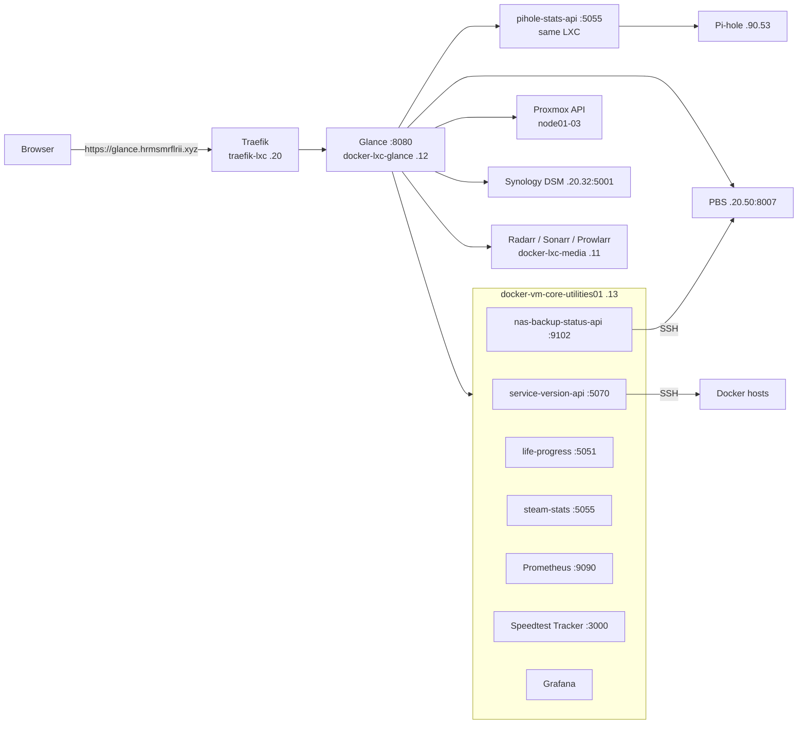

# Glance Homelab Dashboard

Configuration, custom CSS and helper APIs for the [Glance](https://github.com/glanceapp/glance) dashboard that fronts my homelab. It is the first screen I open: one page for life/home widgets, then one page per infrastructure area (services, compute, storage, backup, network, media) and a news page.

**Status (2026-10-06): in daily use.** Glance runs on `docker-lxc-glance` (CT200, 192.168.40.12) and is published at `https://glance.hrmsmrflrii.xyz` through Traefik. This repo was re-synced from the live host on 2026-10-06 with secrets replaced by `${ENV}` placeholders.

| Property | Value |
|----------|-------|
| Host | `docker-lxc-glance` (LXC CT200 on node01), 192.168.40.12 |
| Install path | `/opt/glance` |
| Port | 8080 |
| Image | `glanceapp/glance:latest` |
| Config size | ~145 KB `glance.yml`, 8 pages, 81 widgets |
| Helper APIs | 6 live (see [`apis/`](apis/README.md)) |

## Pages

| Page | Highlights |
|------|-----------|
| 🏠 **Home** | Chess.com stats, clock, weather, sunrise/sunset, calendar, Steam top played, life progress, GitHub contributions, infrastructure status, crypto and stock markets |
| 🛠 **Services** | Health and version of every service grouped as Critical Infrastructure, Auth & Identity, Core Applications, Media Stack, Monitoring & Observability, Custom APIs & Bots, plus a summary and one-click **Update** buttons (service-version-api) |
| 💻 **Compute** | Proxmox cluster nodes, running VMs, VM and container status (Proxmox API), Container Monitoring (Grafana) |
| 💾 **Storage** | Synology DS923+ overview, capacity, system health, temperatures, drive health, RAID volumes, Proxmox storage pools per node and aggregate, Grafana history panels |
| 📦 **Backup** | Backup services monitor, drive health, PBS backup jobs overview, per-VM/CT backup status (nas-backup-status-api), PBS Grafana dashboard |
| 🌐 **Network** | Internet speed and latency (Speedtest Tracker), Pi-hole DNS stats, Omada devices, memory and uptime, connected clients, VLAN map, PoE power, Grafana panels for bandwidth, Wi-Fi quality, switch ports and top clients |
| 🎬 **Media** | Library summary, TV library, NAS media storage, service status, current downloads, Radarr queue, recently added TV, indexer health (Prowlarr), Sonarr/Radarr alerts, movie and TV news |
| 📰 **News** | Tech YouTube plus RSS for tech, AI/ML, cloud, gaming, Android, PC hardware and travel |

Removed on 2026-08-29: Finance, Reddit, Sports and Health pages.

### Embedded Grafana dashboards

| Dashboard UID | Used on |
|---------------|---------|
| `containers-modern` | Compute |
| `synology-nas-modern` | Storage (4 panels) |
| `pbs-backup-status` | Backup |
| `network-utilization` | Network |
| `omada-network` | Network (4 panels) |

## Architecture



## Repository layout

```
.
├── config/
│   ├── glance.yml          # full dashboard config (synced from /opt/glance/config)
│   ├── docker-compose.yml  # Glance container
│   └── .env.example        # variables referenced as ${VAR} in glance.yml
├── assets/
│   └── custom-themes.css   # layout and widget styling
├── apis/                   # helper APIs (one folder each, with Dockerfile/compose)
│   └── _retired/           # APIs no longer wired into the dashboard
├── service.yml             # legacy GitOps metadata (see below)
├── .gitlab-ci.yml          # legacy GitLab pipeline (see below)
└── CHANGELOG.md
```

## Deploy

1. Create an LXC or VM with Docker (CT200 is an LXC; `security_opt: apparmor=unconfined` is needed for Docker inside it).
2. Copy the files:
   ```bash
   sudo mkdir -p /opt/glance && sudo chown $USER /opt/glance
   cp config/docker-compose.yml /opt/glance/
   mkdir -p /opt/glance/config /opt/glance/assets
   cp config/glance.yml /opt/glance/config/
   cp assets/custom-themes.css /opt/glance/assets/
   cp config/.env.example /opt/glance/.env && chmod 600 /opt/glance/.env   # fill in values
   ```
3. Start it: `cd /opt/glance && docker compose up -d`.
4. Deploy the helper APIs you want from [`apis/`](apis/README.md) (`docker compose up -d --build` in each folder).
5. Add a Traefik router for `glance.<domain>` pointing at `http://192.168.40.12:8080`.

Glance reloads `glance.yml` automatically when the file changes; a restart is only needed after changing `.env` or `docker-compose.yml`.

### Secrets

`glance.yml` references these variables; Glance refuses to start if one is missing:

| Variable | Purpose |
|----------|---------|
| `PROXMOX_API_TOKEN` | `user@realm!tokenid=secret` for Compute/Storage widgets (read-only `PVEAuditor` is enough) |
| `RADARR_API_KEY`, `SONARR_API_KEY`, `PROWLARR_API_KEY` | Media page |
| `SERVICE_VERSION_API_KEY` | Update buttons on the Services page (must match the API's `UPDATE_API_KEY`) |

## Making changes

The live host is the source of truth today: edit `/opt/glance/config/glance.yml` (keep a dated `.bak` copy), check the page, then sync the file back here and replace any secret with its `${VAR}`.

```bash
# from a workstation
scp docker-lxc-glance:/opt/glance/config/glance.yml config/glance.yml
grep -nE 'X-Api-Key: "[0-9a-f]|PVEAPIToken=[^$]|key=[^$]' config/glance.yml   # must print nothing
```

Example custom API widget:

```yaml
- type: custom-api
  title: Backup Jobs
  cache: 5m
  url: http://192.168.40.13:9102/status
  template: |
    <div>{{ .JSON.String "nas_sync_duration" }}</div>
```

## Legacy GitLab pipeline

`.gitlab-ci.yml` and `service.yml` came from the GitOps setup on the self-hosted GitLab (`homelab/glance-homelab`). They have not been used for recent changes: the live `.env` the pipeline writes is empty and the config has been edited on the host since. They are kept for reference and still mention OPNsense, which was replaced by TP-Link Omada.

## Troubleshooting

| Symptom | Check |
|---------|-------|
| Page blank / 502 via domain | `ssh docker-lxc-glance "docker ps; docker logs --tail 50 glance"`, then Traefik |
| Glance exits on start | A `${VAR}` in `glance.yml` is not set in `.env` |
| Widget shows "error" | `curl` the widget's URL from the Glance host; most APIs live on .13 |
| Pi-hole widget empty | `curl -s localhost:5055/api/pihole/stats` on CT200; Pi-hole v6 password changed? |
| Update button does nothing | `SERVICE_VERSION_API_KEY` doesn't match the API's `UPDATE_API_KEY` |

## Related

- [homelab-infrastructure](https://github.com/herms14/homelab-infrastructure): the rest of the homelab
- Blog post: [Building Glance Into Something Useful](https://herms14.github.io/Clustered-Thoughts/posts/building-glance-into-something-useful/)
- [Glance docs](https://github.com/glanceapp/glance/blob/main/docs/configuration.md)